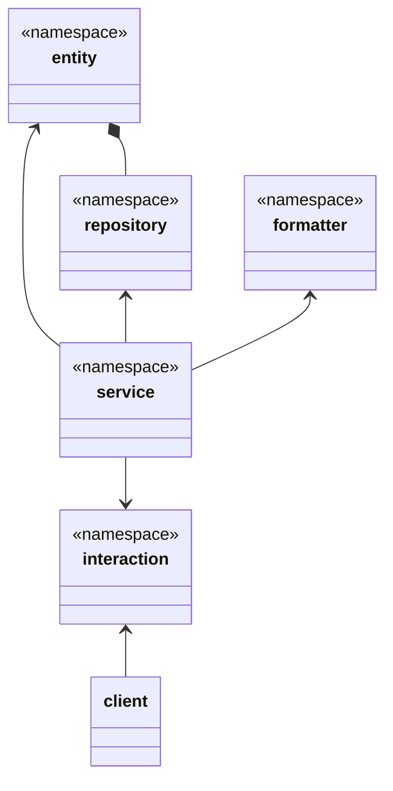

# MemoNest

MemoNest is an exercise CURD memo project inspired by **Clean Architecture**, designed to demonstrate how to build a scalable and testable system. The project adheres to many principles of Clean Architecture, such as decoupling input and output, being independent of frameworks, enforcing unidirectional dependencies, and following **Object-Oriented Design Principles** (SOLID).

## Key Features

- **Clear Separation of Concerns**: Each layer has a well-defined responsibility, making the system easier to develop, test, and maintain.
- **Strong Extensibility**: Each layer can be independently extended or modified without affecting other layers.
- **Flexibility and Maintainability**: Low coupling between layers allows for easy replacement and upgrades of individual components.
- **Simple and Understandable Data Flow**: The data processing flow is clear, making debugging and troubleshooting straightforward.
- **High Testability**: Each layer can be independently tested without dependencies on other layers.

## Architecture Overview

MemoNest consists of six main layers, each serving a distinct role to ensure high cohesion and low coupling in the codebase:

1. **Entity**: Defines the core business entities.
2. **Repository**: Handles data access, responsible for reading and writing business entity data.
3. **Formatter**: Formats and validates data to ensure it complies with required specifications.
4. **Interaction**: Manages interactions with external systems (e.g., clients).
5. **Service**: Executes business logic and coordinates operations across layers.
6. **Factory**: Responsible for creating and assembling components, managing dependency injection, and providing configuration strategies based on the operational mode.

### Data Processing Flow

1. The client sends a request to the **Interaction layer**.
2. The **Formatter layer** transforms the request data format.
3. The **Service layer** executes business logic.
4. The **Repository layer** reads and writes data.
5. The **Formatter layer** transforms the response data format.
6. The **Interaction layer** responds to the client.
7. The **Factory layer** creates and configures all required components.

> Note: The **Factory layer** is the most complex part of the architecture. It depends on all other layers, which is why it's not included in the class diagram.

## Advantages

- **Clear Separation of Concerns**: Each layer has a distinct responsibility, making the system easier to develop, test, and maintain.
- **Strong Extensibility**: You can easily extend or replace individual components without affecting the rest of the system.
- **Simple Data Flow**: The data flow is easy to understand, which helps in debugging and troubleshooting.
- **Good Test Support**: Every layer can be independently tested, improving test coverage.

## Use Cases

MemoNest is particularly useful in the following scenarios:

1. **Frequent Changes in Storage Requirements**: If your application needs to quickly switch between data storage solutions (e.g., from SQL to NoSQL), this architecture allows for easy replacements without impacting the core business logic.
2. **Diverse Interface Requirements**: When you need to support various communication protocols (e.g., HTTP, CLI, WebSocket), MemoNest offers flexible ways to add or modify interfaces without changing the business logic.
3. **Varied Validation Logic**: The system supports different types of validation, and allows combining different validation logic for higher security and flexibility.

## System Design

For a detailed explanation of the system architecture and design, please refer to the full **[System Design Document](https://github.com/avengerandy/MemoNest/blob/master/SYSTEM.md)**.

## Usage Example

## Testing

## License

This project is licensed under the MIT License. See the LICENSE file for more details.
