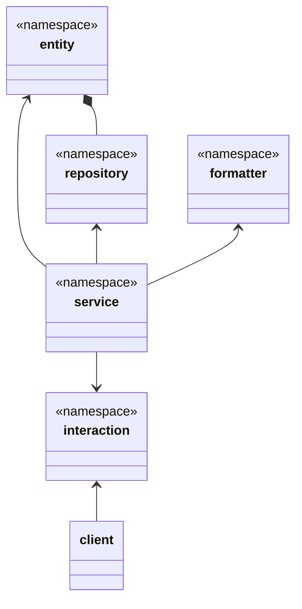
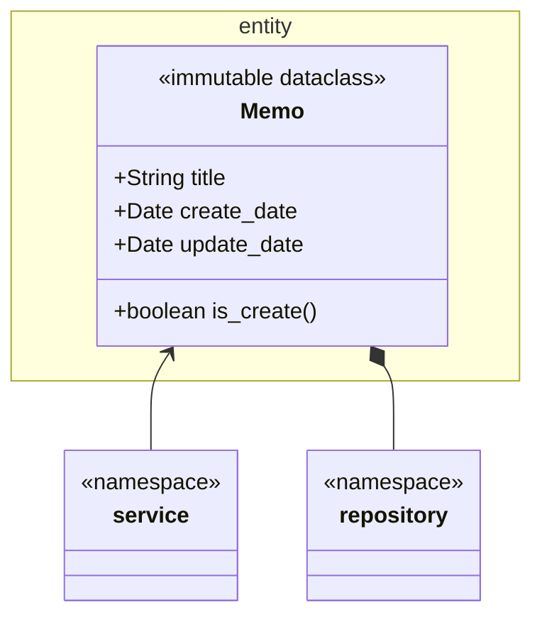
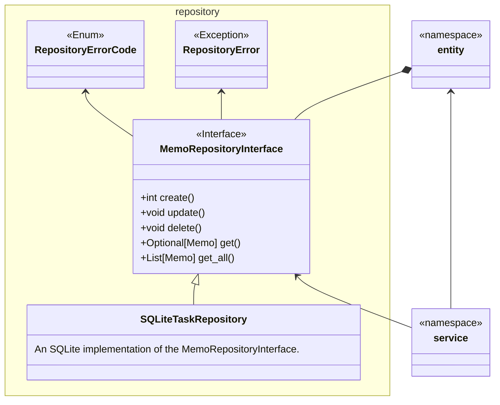
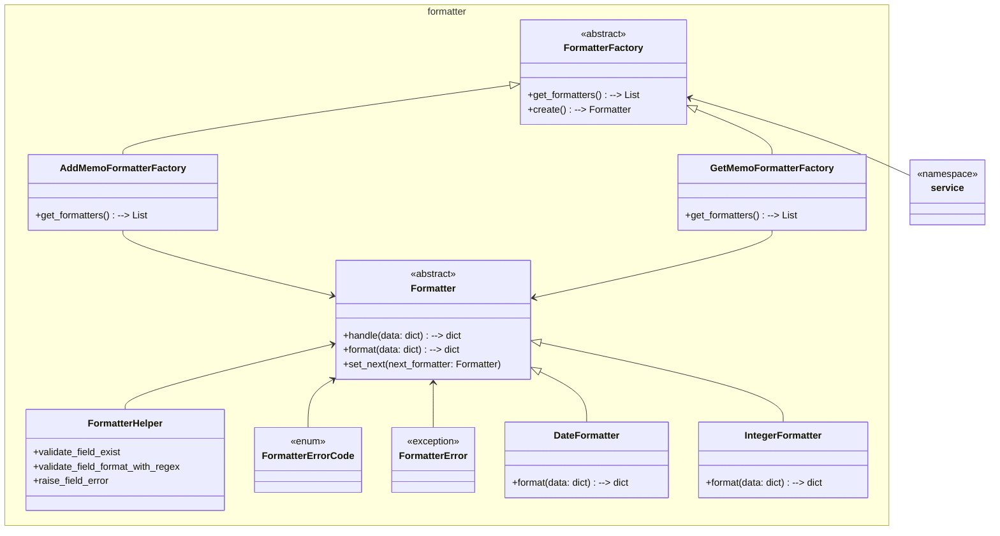
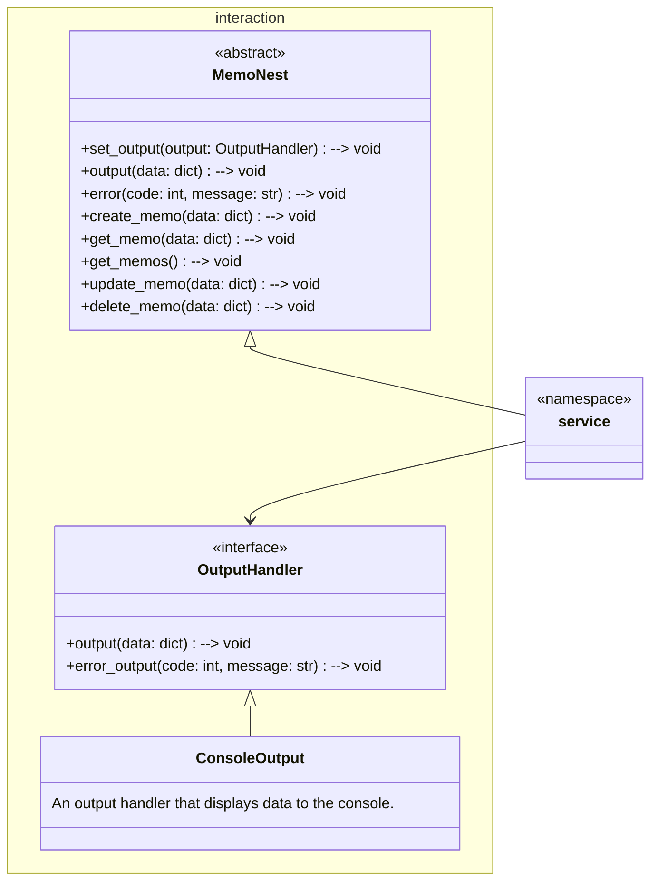
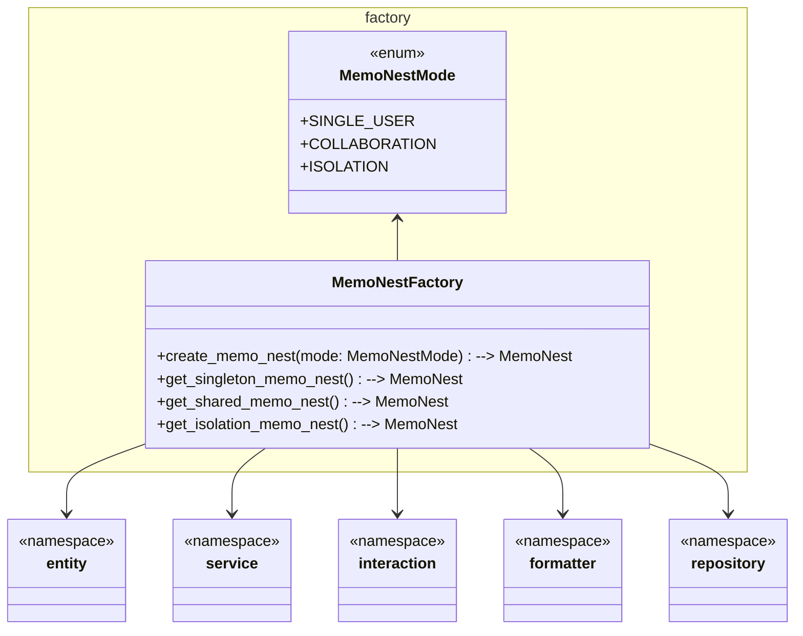

# MemoNest System Design Document

## main architecture

This system consists of six main layers:

* `entity`: Defines the core business entities.
* `repository`: Handles data access, reading and writing entity data.
* `formatter`: Formats and validates data to ensure it complies with the required specifications.
* `interaction`: Manages interactions with external systems (such as clients).
* `service`: Executes business logic and coordinates other layers.
* `factory`: Responsible for creating and assembling all components, handling dependency injection, and managing strategies for various use cases.

### process Overview

* The client sends a request to the `interaction layer` receives the request.
* The `formatter layer` transforms the request data format.
* The `service layer` executes the business logic.
* The `repository layer` reads and writes data.
* The `formatter layer` transforms the response data format.
* The `interaction layer` responds to the client.
* The `factory layer` creates and configures all required components (e.g., service, repository, formatter, interaction).

> The `factory layer` is the most complex (dirty) part of the architecture. It needs to be familiar with all classes and is dependent on all other layers, which is why it is not included in the class diagram.

### advantages:

* Clear Separation of Concerns: Each layer has a well-defined responsibility, making the system easier to develop, test, and maintain.
* Strong Extensibility: It’s easy to extend or modify any layer without affecting the others.
* Flexibility and Maintainability: Low coupling between layers allows easy replacement and upgrades of individual components.
* Clear Data Flow: The data processing flow is simple and easy to understand, making debugging and troubleshooting straightforward.
* Testability: Each layer can be independently tested without dependencies on other layers.
* High Cohesion, Low Coupling: Each layer is focused on a single responsibility, reducing interdependencies and improving code maintainability.
* Unidirectional Dependencies: The dependencies between layers are one-way, avoiding cyclic dependencies and ensuring the stability of the architecture.

## entity

The `entity layer` contains the `Memo` class, which is the core business entity in the system. The `Memo` class is immutable, meaning its properties cannot be changed once it is created.

### relation

* The `service layer` depends `Memo` to perform operations.
* The `repository layer` depends on `Memo` to store or retrieve data.

## repository

* `RepositoryErrorCode`: An enum class that defines error codes related to database operations.
* `RepositoryErro`r: An exception class used to represent errors that occur during database operations.
* `MemoRepositoryInterface`: This interface defines the basic operations for handling memo, such as creating, updating, deleting, retrieving a single memo, and retrieving all memos. Other concrete implementations will implement this interface.
* `SQLiteTaskRepository`: A concrete implementation of `MemoRepositoryInterface`, using SQLite as the backend to handle the storage and retrieval memo.

### relation

* `MemoRepositoryInterface` depends on the `entity layer` for data operations.
* The `service layer` depends on `MemoRepositoryInterface` to perform data operations as part of the business logic.

## formatter

The Formatter layer uses the `Chain of Responsibility` pattern for handling data formatting tasks in sequence and the `Factory pattern` for creating and configuring formatter chains based on specific requirements.

* `Formatter (Abstract Class)`: This is the base class for all concrete formatters, providing two main methods:
    * `handle(data: dict)` is responsible for processing the data and passing it to the next formatter in the chain (if it exists).
    * `format(data: dict)` is an abstract method that each concrete formatter must implement to format specific fields.
    * `set_next(next_formatter: Formatter)` sets the next formatter in the chain, which is key to implementing the `Chain of Responsibility` pattern.
* `Concrete Formatter Classes` (such as `DateFormatter`, `IntegerFormatter`):
    * These concrete formatters implement the `format()` method and process specific fields in the data.
* `FormatterHelper`: A utility class providing static methods for common field validation and error handling.
* `FormatterErrorCode`: An enum class that defines error codes related to formatting process.
* `FormatterError`: An exception class used to represent errors that occur during formatting process.
* `FormatterFactory (Abstract Factory Class)`: This factory class is responsible for creating and returning a chain of formatters. It defines two main methods:
    * `get_formatters()` returns the list of formatters to be applied.
    * `create()` chains the formatters together in sequence.
* `Concrete FormatterFactory Classes` (such as `AddMemoFormatterFactory` and `GetMemoFormatterFactory`):
    * These factory classes create different formatter chains depending on the use case (e.g., for adding a memo or retrieving a memo).

### relation

* The `service layer` depends on `FormatterFactory` to transforms the request data from client & responds data to the client.

## interaction

This module defines use cases and output interfaces for interacting with clients, decoupling the core application logic from the specifics of how data is presented or transmitted.

* `OutputHandler`: An abstract class for handling output and error messages. It allows different output mechanisms (e.g., console, UI, network) to be injected into the system.
    * `output(data: dict)`: Outputs data.
    * `error_output(code: int, message: str)`: Handles error messages.
* `ConsoleOutput`: A concrete implementation of OutputHandler that displays data and error messages on the console.
* `MemoNest`: An abstract class that encapsulates business logic for memo operations, delegating output responsibilities to the OutputHandler. It defines methods for creating, retrieving, updating, and deleting memos.

This design follows both the Dependency Inversion Principle and the Interface Segregation Principle.

* Dependency Inversion Principle: The core application logic (e.g., MemoNest) does not depend on specific output mechanisms. Instead, it relies on the abstract OutputHandler interface, allowing for flexibility in how data is presented or transmitted (e.g., via console, UI, or network).
* Interface Segregation Principle: The MemoNest class provides a clear, focused interface for memo operations (create, get, update, delete) while delegating the output responsibility to the OutputHandler. This ensures that clients of MemoNest only interact with the necessary methods, avoiding unnecessary dependencies on output details.

### relation

* The `service layer` depends on `MemoNest` & `ConsoleOutput` to interact with external systems (such as clients).

## factory

The factory layer is responsible for creating `MemoNest` instances for different scenarios.

The `MemoNestFactory` implements the `Factory Pattern`, offering a unified interface to generate the appropriate `MemoNest` instances based on the chosen operational mode. The module supports three operation modes:

1. Single-user mode: In this mode, all components (such as `MemoRepository` and `OutputHandler`) are singletons, shared across all operations.

1. Multi-user Collaboration mode: In this mode, a shared `MemoRepository` is used, but a new `MemoNest` instance and `OutputHandler` are created for each operation.

1. Multi-user Isolation mode: In this mode, a new `MemoNest`, `MemoRepository`, and `OutputHandler` instance are created for each operation, ensuring full isolation between users’ data and actions.

This design ensures the system is scalable and flexible, adapting to different use cases while properly allocating resources for each scenario.

### relation

* The `factory layer` depends on all other layers.
